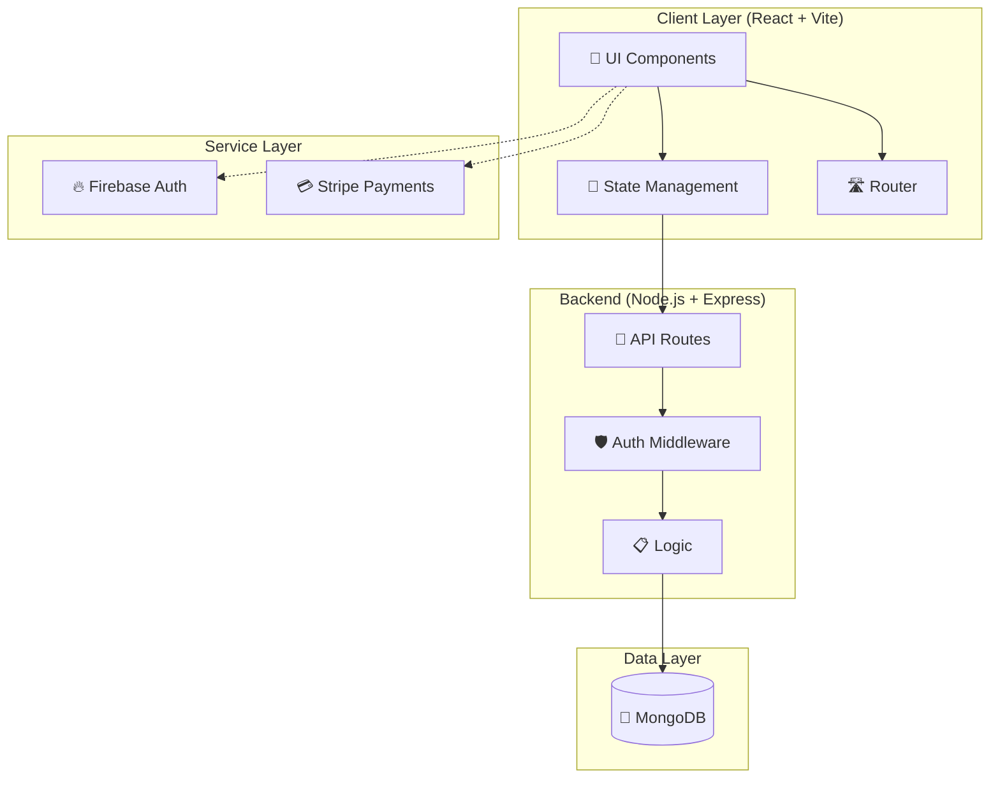

# 🎓 Akademi - Premium Scholarship Management System

<div align="center">


[](https://akademi-scholarship.vercel.app/)
[](https://www.typescriptlang.org/)
[](https://reactjs.org/)
[](https://nodejs.org/)

**A production-grade, full-stack scholarship management platform with premium UI/UX**

[Live Demo](https://akademi-scholarship.vercel.app/) • [Features](#-key-features) • [Tech Stack](#-technology-stack) • [Quick Start](#-quick-start) • [Documentation](#-documentation)

</div>

---

## 📖 **Overview**

Akademi is a comprehensive **Scholarship Management System** featuring premium glassmorphism design, real-time application tracking, and role-based dashboards for **Students**, **Moderators**, and **Admins**. Built with MERN stack and optimized for a seamless academic experience.

### **🌟 Highlights**

- ✨ **Premium UI/UX** with advanced Glassmorphism & Framer Motion animations
- 🔐 **Secure Authentication** with Firebase & Role-Based Access Control (RBAC)
- 📊 **Real-time Analytics** for scholarship applications and reviews
- 💳 **Secure Payments** integrated with Stripe for application fees
- 🎨 **Modern Design System** using Tailwind CSS and Outfit typography
- ⚡ **Lightning Fast** built with Vite 6 and Node.js 21
- 📱 **Fully Responsive** mobile-first architecture
- ♿ **Accessible** WCAG 2.1 AA compliant

---

## 🎯 **Key Features**

### 🏠 **Public Pages**

| Page | Description | Live URL |
|------|-------------|----------|
| **Home** | Immersive landing with scholarship showcases & statistics | [View →](https://akademi-scholarship.vercel.app/) |
| **All Scholarships** | Advanced filtering and search for available grants | [View →](https://akademi-scholarship.vercel.app/all-scholarships) |
| **About Us** | Our mission to democratize education access | [View →](https://akademi-scholarship.vercel.app/about) |
| **Contact** | Support portal with real-time feedback | [View →](https://akademi-scholarship.vercel.app/contact) |

### 🔐 **Authentication & Security**

- **Firebase Auth** - Industry-standard secure login/register
- **RBAC** - Distinct flows for Student, Moderator, and Admin
- **JWT Protection** - Secure API communication
- **Secure Payments** - Stripe-powered fee processing

---

## 🛠️ **Technology Stack**

### **Frontend**

<table>
<tr>
<td>

**Core**
- ⚛️ React 18.3
- ⚡ Vite 6.0
- 🛣️ React Router 7

</td>
<td>

**Styling**
- 🎨 Tailwind CSS 3.4
- 🎭 Framer Motion 12
- 🌈 Custom Glassmorphism

</td>
<td>

**State & Data**
- 🔄 Context API
- 💾 LocalForage
- 📊 Recharts

</td>
</tr>
</table>

### **Backend**

<table>
<tr>
<td>

**Core**
- 🟢 Node.js 21+
- 🚂 Express 4.21
- 🍃 MongoDB

</td>
<td>

**Services**
- 💳 Stripe API
- 🔥 Firebase Admin
- 🔐 JWT

</td>
<td>

**Middleware**
- 🌐 CORS
- 🛡️ Helmet.js
- 📝 Morgan

</td>
</tr>
</table>

---

## 📂 **Project Structure**

```
scholarship/
├── 📁 client/                 # React + Vite Frontend
│   ├── 📁 src/
│   │   ├── 📁 components/       # UI & Feature components
│   │   ├── 📁 pages/            # View pages
│   │   ├── 📁 context/          # State management
│   │   └── 📄 index.css         # Design System
│
├── 📁 server/                 # Node.js + Express Backend
│   ├── 📄 index.js           # Entry point
│   └── 📄 package.json       # Backend dependencies
│
└── 📄 README.md               # Elite Documentation
```

---

## 🚀 **Quick Start**

### **Prerequisites**

- Node.js 20+
- npm or yarn
- MongoDB Connection URI
- Firebase Configuration

### **Installation**

```bash
# 1. Clone & Setup
git clone https://github.com/rak9b/Akademi---Scholarship-Management-System.git
cd Akademi---Scholarship-Management-System

# 2. Setup Backend
cd server
npm install
npm start

# 3. Setup Frontend
cd ../client
npm install
npm run dev
```

---

## 🏗️ **System Architecture**



---

## 📝 **License**

This project is licensed under the **MIT License**.

---

<div align="center">

**Built with ❤️ for Educational Excellence**

⭐ **Star this repo if you found it helpful!** ⭐

</div>
