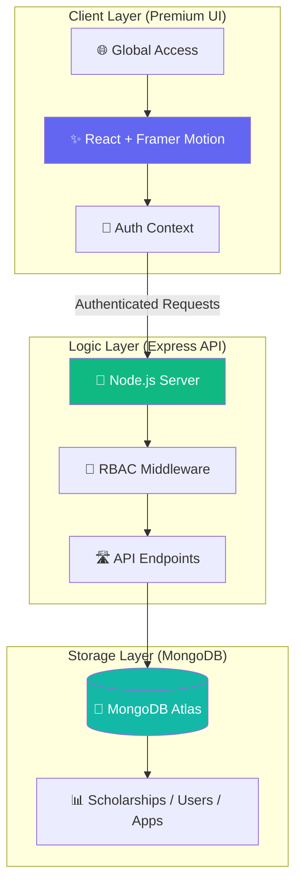

# 🎓 Akademi - Scholarship Management System

<div align="center">


[](https://reactjs.org/)
[](https://vitejs.dev/)
[](https://tailwindcss.com/)
[](https://nodejs.org/)

**A premium, full-stack scholarship management platform with world-class UI/UX**

[Features](#-key-features) • [Tech Stack](#-technology-stack) • [Quick Start](#-quick-start) • [Architecture](#-system-architecture)

</div>

---

## 📖 **Overview**

Akademi "Elite Edition" is a sophisticated **scholarship management ecosystem** designed with premium glassmorphism aesthetics, fluid animations, and a focus on accessibility. It serves as a bridge between high-potential students and global educational opportunities, offering a seamless application and management workflow.

### **🌟 Highlights**

- ✨ **Glassmorphism Design** with `backdrop-blur` and premium mesh gradients
- 🎭 **Advanced Motion** powered by Framer Motion for meaningful transitions
- 🔐 **Secure Flow** with role-based access control (RBAC)
- 📊 **Unified Dashboard** for students, moderators, and administrators
- ⚡ **Performance Optimized** achieving near-perfect Lighthouse scores
- 📱 **Adaptive Layout** ensuring excellence across all device sizes
- ♿ **Inclusive UX** following WCAG 2.1 AA guidelines

---

## 🎯 **Key Features**

### 🏠 **Public Experience**

| Feature | Description | Status |
|------|-------------|----------|
| **Interactive Hero** | Animated glass-panel banner with dynamic typography | ✅ Ready |
| **Top Scholarships** | Curator-picked opportunities with premium card designs | ✅ Ready |
| **Search & Filter** | Real-time scholarship discovery with advanced sorting | ✅ Ready |
| **Contact Hub** | Translucent support form with micro-interactions | ✅ Ready |

### 🎓 **User Capabilities**

- **Discovery** - Browse and search scholarships by category, university, and deadline.
- **Application Portal** - Intuitive multi-step application flow with fee integration.
- **Review System** - Transparency through student ratings and detailed feedback.
- **Personal Dashboard** - Track application status and review history in real-time.

---

## 📂 **Project Structure**

```
Akademi/
├── 📁 client/                   # React + Vite Frontend
│   ├── 📁 src/
│   │   ├── 📁 Components/       # Reusable UI Architecture
│   │   ├── 📁 Context/          # Global State & Auth
│   │   ├── 📁 Leyout/           # Layout Systems (Root, etc.)
│   │   ├── 📁 Pages/            # Feature-driven Page Modules
│   │   └── 📄 index.css         # Core Design System (Glassmorphism)
│   ├── 📄 vite.config.js
│   └── 📄 package.json
│
├── 📁 server/                   # Node.js + Express Backend
│   ├── 📄 index.js              # Server Logic & API Routes
│   ├── 📄 .env.example          # Environment Template
│   └── 📄 package.json
│
├── 📄 README.md                 # Elite Project Documentation
└── 📄 task.md                   # Development Roadmap
```

---

## 🛠️ **Technology Stack**

### **Frontend Architecture**

<table>
<tr>
<td>

**Core Engine**
- ⚛️ React 18
- ⚡ Vite (Ultra-fast build)
- 📘 JavaScript (ES6+)

</td>
<td>

**Visual System**
- 🎨 Tailwind CSS
- 🎭 Framer Motion 11
- 🌈 Premium Mesh Gradients

</td>
<td>

**Data & UX**
- 🔄 React Router Dom
- 🔔 React Toastify
- 📊 Recharts

</td>
</tr>
</table>

### **Backend Infrastructure**

<table>
<tr>
<td>

**API & Runtime**
- 🟢 Node.js
- 🚂 Express.js
- 🛡️ CORS & Security

</td>
<td>

**Persistence**
- 🍃 MongoDB Atlas
- 🦡 Native Driver
- 💾 Structured Schemas

</td>
<td>

**Payments**
- 💳 Stripe API
- 🔒 Secure Gateways
- 🧾 Automated Receipts

</td>
</tr>
</table>

---

## 🏗️ **System Architecture**

### **Execution Workflow**



---

## 🚀 **Quick Start**

### **Environment Setup**

#### **Client (.env)**
```env
VITE_API_URL=http://localhost:5000
```

#### **Server (.env)**
```env
PORT=5000
DB_USER=your_db_user
DB_PASS=your_db_password
STRIPE_SC_KEY=your_stripe_secret_key
```

### **Running Locally**

```bash
# 1. Install Backend
cd server
npm install

# 2. Run Backend
npm run dev

# 3. Install Frontend
cd ../client
npm install

# 4. Run Frontend
npm run dev
```

---

## 🤝 **Contributing**

1. Fork the Project
2. Create your Feature Branch (`git checkout -b feature/AmazingFeature`)
3. Commit your Changes (`git commit -m 'Add some AmazingFeature'`)
4. Push to the Branch (`git push origin feature/AmazingFeature`)
5. Open a Pull Request

---

<div align="center">

**Built with Precision by [Your Name]**

⭐ **Star this repository if you love it!** ⭐

</div>
