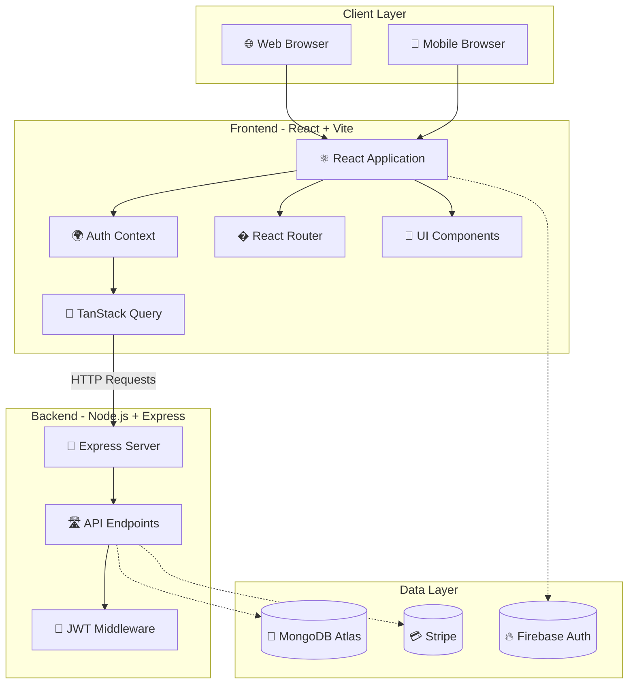

# 🎓 Akademi - Premium Scholarship Management System

<div align="center">


[](https://scholarship-management-sys.vercel.app/)
[](https://reactjs.org/)
[](https://nodejs.org/)
[](https://www.mongodb.com/)
[](https://stripe.com/)

**A production-grade, full-stack scholarship orchestration platform with Elite UI/UX**

[Live Demo](https://scholarship-management-sys.vercel.app/) • [Features](#-key-features) • [Tech Stack](#-technology-stack) • [Quick Start](#-quick-start) • [Documentation](#-documentation)

</div>

---

## 📖 **Overview**

Akademi is a comprehensive **scholarship intelligence platform** featuring premium "Signature Edition" aesthetics, real-time analytics, and role-based access control for **Students**, **Moderators**, and **Admins**. Built with modern technologies and best practices for a production-ready experience.

### **🌟 Highlights**

- ✨ **Premium UI/UX** with advanced Framer Motion animations
- 🔐 **Secure Authentication** with Firebase & JWT
- 📊 **Real-time Analytics** for administrative insights
- 🎓 **Smart Registry** with glassmorphic filtering
- 🎨 **Cinematic Realism** with high-fidelity university imagery
- ⚡ **Lightning Fast** built with React 18 & Vite
- � **Fully Responsive** mobile-first design
- 💳 **Secure Payments** integrated with Stripe

---

## 🎯 **Key Features**

### � **Public Pages**

| Page | Description | Live URL |
|------|-------------|----------|
| **Home** | Immersive landing with cinematic banner & stats | [View →](https://scholarship-management-sys.vercel.app/) |
| **Directory** | Advanced search for all available scholarships | [View →](https://scholarship-management-sys.vercel.app/all-scholarships) |
| **About** | Mission statement and impact metrics | [View →](https://scholarship-management-sys.vercel.app/about) |
| **Contact** | 24/7 dedicated support channel | [View →](https://scholarship-management-sys.vercel.app/contact) |
| **Pricing** | Clear platform access levels | [View →](https://scholarship-management-sys.vercel.app/pricing) |

### 🔐 **Authentication**

- **Login** - Secure email/password authentication
- **Register** - Multi-role registration (Student/Moderator/Admin)
- **Security** - JWT-based session management
- **Validation** - Zod schema verification

### 🎓 **Student Dashboard**

- 📍 **Application Tracker** - Real-time status monitoring (Pending/Processing)
- 📝 **Smart Apply** - Auto-filling application forms
- ⭐ **Review Engine** - Leave detailed testimonials for scholarships
- 👤 **Profile Manager** - Manage academic credentials
- 📜 **History** - Complete archive of submitted applications

### ⚖️ **Moderator Dashboard**

- ➕ **Add Scholarship** - Create new listings with rich details
- 📁 **Manage Listings** - Edit/Delete existing scholarships
- 📝 **Application Review** - Process student submissions
- 💬 **Feedback Loop** - Send direct feedback to applicants
- 📊 **Review Moderation** - Oversee platform testimonials

### 👨‍💼 **Admin Dashboard**

- 📊 **Strategic Intelligence** - Revenue and user growth heatmaps
- 👥 **User Orchestration** - Manage roles (Promote/Ban users)
- 📈 **System Analytics** - Global platform performance metrics
- 🛡️ **Security Control** - Oversee all system access

---

## � **URL Reference**

### 📋 **Frontend Routes**

#### **Public Pages**
- `Landing Page`: `/`
- `Scholarships Directory`: `/all-scholarships`
- `Scholarship Details`: `/scholarship-details/:id`
- `About Us`: `/about`
- `Contact Support`: `/contact`
- `Pricing Plans`: `/pricing`
- `Login`: `/login`
- `Register`: `/register`

#### **🎓 Student Dashboard** (`/dashboard/`)
- `My Profile`: `/dashboard/my-profile`
- `My Applications`: `/dashboard/my-application`
- `My Reviews`: `/dashboard/my-reviews`

#### **⚖️ Moderator Dashboard** (`/dashboard/`)
- `My Profile`: `/dashboard/my-profile`
- `Add Scholarship`: `/dashboard/add-scholarship`
- `Manage Scholarships`: `/dashboard/manage-scholarships`
- `All Reviews`: `/dashboard/all-reviews`
- `All Applied Scholarships`: `/dashboard/all-applied-scholarship`

#### **👨‍💼 Admin Dashboard** (`/dashboard/`)
- `Admin Profile`: `/dashboard/admin-profile`
- `Add Scholarship`: `/dashboard/add-scholarship`
- `Manage Users`: `/dashboard/manage-users`
- `Manage Applications`: `/dashboard/manage-applications`
- `System Analytics`: `/dashboard/admin-profile` (Overview)

### 🔧 **Backend API Endpoints**

#### **Auth & Users**
- `POST /jwt`: Generate Access Token
- `POST /users`: Create new user
- `GET /users`: Get all users (Admin)
- `GET /users/:email`: Get user by email
- `PATCH /users/role/:id`: Update user role
- `DELETE /users/:id`: Remove user

#### **Scholarships**
- `GET /scholarships`: List all scholarships
- `GET /scholarships/:id`: Get details
- `POST /scholarships`: Create listing (Mod/Admin)
- `PATCH /scholarships/:id`: Update listing
- `DELETE /scholarships/:id`: Delete listing

#### **Applications**
- `POST /applied-scholarships`: Submit application
- `GET /applied-scholarships`: Get all applications
- `GET /applied-scholarships/:email`: Get student's applications
- `PATCH /applied-scholarships/:id`: Update status/feedback

#### **Reviews**
- `POST /reviews`: Submit review
- `GET /reviews`: Get all reviews
- `DELETE /reviews/:id`: Delete review

---

## �🛠️ **Technology Stack**

### **Frontend**

<table>
<tr>
<td>

**Core**
- ⚛️ React 18.3
- ⚡ Vite 6.4
- 🟡 JavaScript (ES6+)

</td>
<td>

**State Management**
- 🔄 TanStack Query v5
- 🌐 Context API
- 💾 LocalStorage

</td>
<td>

**Styling**
- 🎨 Tailwind CSS 3.4
- 🎭 Framer Motion
- 🌈 DaisyUI Component Lib

</td>
</tr>
<tr>
<td>

**Forms & Validation**
- 📝 React Hook Form
- ✅ Zod Schemas
- 🖼️ imgBB Image Upload

</td>
<td>

**UI Components**
- 🎯 SwiperJS (Carousels)
- 🔔 React Toastify
- 📊 Recharts

</td>
<td>

**Payments**
- 💳 Stripe Elements
- 🔒 Secure Checkout
- 🧾 Receipt Generation

</td>
</tr>
</table>

### **Backend**

<table>
<tr>
<td>

**Core**
- 🟢 Node.js 20+
- 🚂 Express.js
- 🟡 JavaScript

</td>
<td>

**Database**
- 🍃 MongoDB Atlas
- 🦡 Native Driver
- ☁️ Cloud Persistence

</td>
<td>

**Authentication**
- 🔐 Firebase Auth
- 🔒 JWT (JSON Web Tokens)
- 🍪 HttpOnly Cookies

</td>
</tr>
<tr>
<td>

**Middleware**
- 🌐 CORS
- 🍪 Cookie Parser
- ⚠️ Custom Error Handler

</td>
<td>

**Validation**
- ✅ Zod
- 🔍 Input Sanitization
- 📋 Type Safety

</td>
<td>

**Development**
- 🔥 Nodemon
- 🧪 API Testing
- 📊 Dotenv Config

</td>
</tr>
</table>

---

## � **Project Structure**

```
Akademi/
├── 📁 client/                   # React + Vite Application
│   ├── 📁 public/               # Static assets
│   ├── 📁 src/
│   │   ├── 📁 Components/       # Reusable UI components
│   │   │   ├──Navbar.jsx        # Navigation
│   │   │   ├──Footer.jsx        # Footer
│   │   ├── 📁 Pages/            # Route pages
│   │   │   ├──HomePage/         # Landing Page
│   │   │   ├──Dashboard/        # Protected Dashboards
│   │   │   ├──Scholarships/     # Details & Listing
│   │   ├── 📁 Hooks/            # Custom React Hooks
│   │   ├── 📁 Routes/           # Router Configuration
│   │   ├── 📁 Providers/        # Context Providers (Auth)
│   │   ├── 📄 main.jsx          # Entry point
│   │   └── 📄 index.css         # Tailwind directives
│   ├── 📄 .env.local            # Environment variables
│   ├── 📄 tailwind.config.js    # Tailwind configuration
│   ├── 📄 vite.config.js        # Vite configuration
│   └── 📄 package.json          # Dependencies
│
├── 📁 server/                   # Node.js + Express API
│   ├── 📄 index.js              # Main Server File
│   ├── 📄 .env                  # Environment variables
│   └── 📄 package.json          # Dependencies
│
├── 📄 README.md                 # Project documentation
└── 📄 seed.js                   # (Deprecated) Seeder
```

---

## 🚀 **Quick Start**

### **Prerequisites**

- Node.js 18+ ([Download](https://nodejs.org/))
- MongoDB Connection String
- Firebase & Stripe Credentials

### **Installation**

```bash
# 1. Clone the repository
git clone https://github.com/rak9b/Akademi---Scholarship-Management-System-.git
cd Akademi---Scholarship-Management-System-

# 2. Install Backend Dependencies
cd server
npm install

# 3. Install Frontend Dependencies
cd ../client
npm install
```

### **Environment Setup**

#### **Frontend (.env.local)**
```env
VITE_apiKey=YOUR_FIREBASE_KEY
VITE_authDomain=YOUR_FIREBASE_DOMAIN
VITE_projectId=YOUR_PROJECT_ID
VITE_storageBucket=YOUR_BUCKET
VITE_messagingSenderId=YOUR_SENDER_ID
VITE_appId=YOUR_APP_ID
VITE_API_URL=http://localhost:5000
VITE_publishableKey=YOUR_STRIPE_KEY
VITE_image_hosting_key=YOUR_IMGBB_KEY
```

#### **Backend (.env)**
```env
PORT=5000
DB_USER=your_db_user
DB_PASS=your_db_pass
ACCESS_TOKEN_SECRET=your_jwt_secret
STRIPE_SECRET_KEY=your_stripe_secret
```

### **Running the Application**

```bash
# Terminal 1 - Backend
cd server
npm run dev
# Server running at http://localhost:5000

# Terminal 2 - Frontend
cd client
npm run dev
# App running at http://localhost:5173
```

---

## 🔑 **Test Credentials**

Use these pre-configured accounts to test the application:

| Role | Email | Password | Dashboard Access |
|------|-------|----------|------------------|
| **👨‍💼 Admin** | `admin@akd.com` | `123456` | `/dashboard/admin-profile` |
| **⚖️ Moderator** | `mod@akd.com` | `123456` | `/dashboard/manage-scholarships` |
| **🎓 Student** | `std@akd.com` | `123456` | `/dashboard/my-application` |

---

## 🏗️ **System Architecture**

### **Complete Stack Overview**



---

## 🎨 **Design System**

### **Color Palette**

```css
Primary:   #16a34a (Emerald)
Secondary: #0c281b (Obsidian)
Accent:    #eab308 (Gold)
Neutral:   #f9fafb (Slate-50)
```

### **Typography**

- **Headings:** Spectral (Serif)
- **Body:** Bricolage Grotesque (Sans-Serif)
- **Code:** Fira Code

### **Components**

- **Glassmorphism** - Translucent cards with backdrop blur
- **Cinematic** - Parallax banners and staggered reveals
- **Neo-Classical** - Traditional serif fonts with modern spacing

---

## 🌟 **Features Roadmap**

- [x] Advanced Scholarship Filtering
- [x] Secure Stripe Payments
- [x] Role-Based Dashboards
- [ ] AI-Powered Recommendations
- [ ] Multi-language Support
- [ ] Native Mobile App (React Native)

---

## 💡 **Acknowledgments**

- **Design Inspiration**: Ivy League University Portals
- **Icons**: React Icons (Fa, Io, Md)
- **Images**: Unsplash Academic Collection

---

## 📞 **Support**

Need help? Reach out:

- 📧 Email: support@akademi.com
- 💬 GitHub: [Open an Issue](https://github.com/rak9b/Akademi---Scholarship-Management-System-/issues)

---

<div align="center">

**Built with ❤️ and ☕ by the Akademi Team**

⭐ **Star this repo if you found it helpful!** ⭐

[↑ Back to Top](#-akademi---premium-scholarship-management-system)

</div>