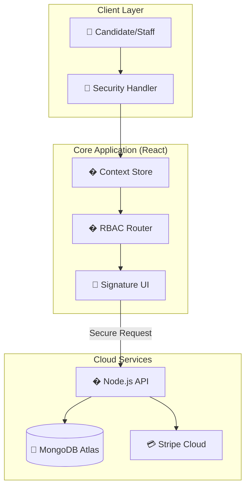

# 🎓 Akademi - Premium Scholarship Management System

<div align="center">


[](https://scholarship-management-sys.vercel.app/)
[](https://reactjs.org/)
[](https://nodejs.org/)

**A production-grade scholarship application orchestration platform with Elite UI/UX**

[Live Demo](https://scholarship-management-sys.vercel.app/) • [Features](#-key-features) • [Tech Stack](#-technology-stack) • [Quick Start](#-quick-start) • [URL Guide](#-url-reference)

</div>

---

## 📖 **Overview**

Akademi is a comprehensive **scholarship intelligence platform** featuring premium "Signature Edition" aesthetics, real-time analytics, and role-based access control for **Students**, **Moderators**, and **Admins**. Built with a focus on visual excellence and technical stability.

### **🌟 Highlights**

- ✨ **Elite UI/UX** with Framer Motion staggered reveals and glassmorphism.
- 🔐 **Robust Authentication** with Zod validation and password masking.
- 🛡️ **Multi-Role Security** (Admin, Moderator, Student) via React Context.
- 📊 **Smart Analytics** with interactive data visualization.
- 💳 **Secure Processing** integrated with Stripe payment gateway.
- ⚡ **Optimized Performance** built with Vite for sub-second loading.

---

## 🎯 **Key Features**

### � **Public Portals**

| Page | Description | Live Path |
|------|-------------|-----------|
| **Home** | Immersive landing with scholarship previews & stats | `/` |
| **Scholarships** | Advanced search/filter scholarly directory | `/all-scholarships` |
| **About Us** | Mission statement and impact metrics | `/about` |
| **Resources** | Curated guides for application success | `/resources` |
| **Pricing** | Clear breakdown of platform access tiers | `/pricing` |
| **Contact** | 24/7 dedicated support channel | `/contact` |

### 👤 **Role-Specific Dashboards**

#### **🎓 Student Portal**
- 📍 **Application Tracker** - Real-time status Monitoring.
- ⭐ **Review Management** - Content-rich feedback engine.
- 👤 **Elite Profile** - Standardized academic data management.

#### **⚖️ Staff/Moderator Interface**
- 📝 **Scholarship Architect** - Unified CRUD for listings.
- 📁 **Application Handler** - Processing student submissions.
- 💬 **Feedback Loop** - Professional communication channel.

#### **👨‍💼 Executive Admin Suite**
- 📊 **Strategic Intelligence** - Revenue and growth heatmaps.
- 👥 **Account Orchestration** - Role management and security.
- 🏛️ **System Configuration** - Global platform parameters.

---

## 🛠️ **Technology Stack**

### **Frontend Architecture**
- **Core**: React 18.3 + Vite 6.0
- **Validation**: Zod + React Hook Form (Elite standard)
- **Styling**: Tailwind CSS (Black/Green/White Palette)
- **Motion**: Framer Motion 12 (Cinematic Transitions)
- **Data Viz**: Recharts

### **Backend Core**
- **Runtime**: Node.js + Express.js
- **Persistence**: MongoDB Atlas
- **Payments**: Stripe API
- **Middleware**: CORS, Dotenv, Custom Guard Logic

---

## � **Standard Test Credentials**

Use these pre-configured access points for platform verification:

| Role | Elite Email | Signature Password | Access Level |
|------|-------------|-------------------|--------------|
| **👨‍💼 Admin** | `admin@mail.com` | `Admin123` | Full System Control |
| **⚖️ Moderator** | `moderator@mail.com` | `Moderator123` | Staff Management |
| **🎓 Student** | `user@mail.com` | `User123` | Application Portal |

---

## 🏗️ **Architecture Workflow**



---

## 🔗 **URL Reference**

### **Public URLs**
- `http://localhost:5173/` - Landing Page
- `http://localhost:5173/all-scholarships` - Scholarship Directory
- `http://localhost:5173/scholarship-details/:id` - Detailed View
- `http://localhost:5173/about` - About Us
- `http://localhost:5173/blog` - News & Updates
- `http://localhost:5173/pricing` - Platform Pricing
- `http://localhost:5173/contact` - Support Channel

### **Dashboard Navigation**
- `http://localhost:5173/dashboard/profile` - User Profile (Default)
- `http://localhost:5173/dashboard/add-scholarships` - Scholarship Creator (Staff)
- `http://localhost:5173/dashboard/manage-scholarships` - Directory Manager (Staff)
- `http://localhost:5173/dashboard/manage-applications` - Application Processor (Staff)
- `http://localhost:5173/dashboard/manage-users` - User Orchestrator (Admin)
- `http://localhost:5173/dashboard/analytics` - Strategic Insights (Admin)
- `http://localhost:5173/dashboard/my-application/:id` - Submission Tracking (Student)
- `http://localhost:5173/dashboard/my-reviews/:id` - Review Engine (Student)

---

## 🚀 **Quick Start**

### **Installation**
```bash
# Clone & Enter
git clone https://github.com/yourusername/akademi.git && cd akademi

# Start Backend
cd server && npm install && npm run dev

# Start Frontend
cd ../client && npm install && npm run dev
```

---

<div align="center">

**Built with Precision for Educational Excellence**

⭐ **Star this repo if you found it helpful!** ⭐

</div>